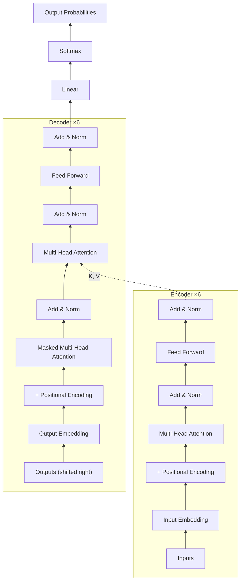
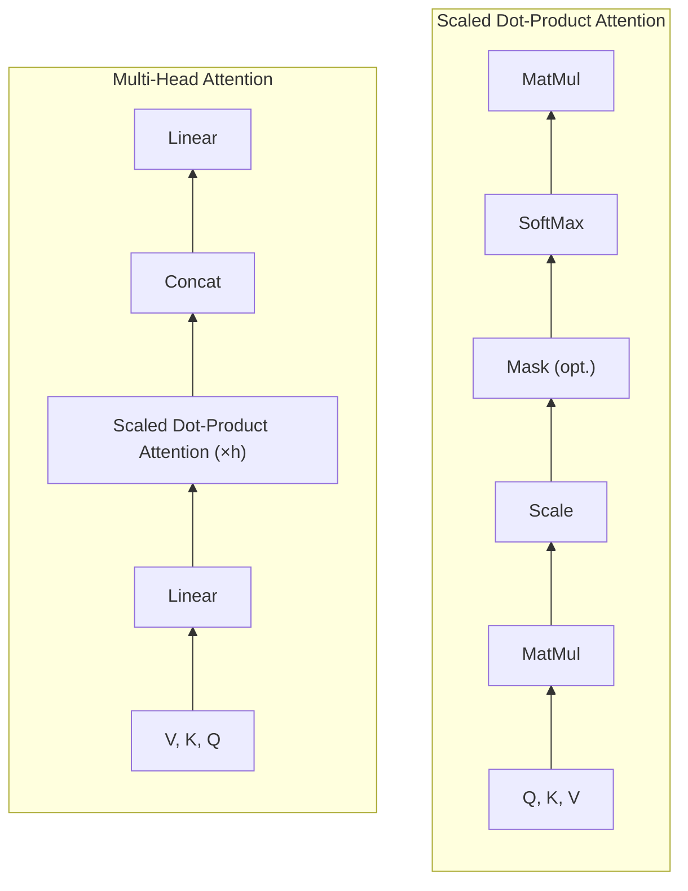

# transformer-from-scratch

The Transformer from *Attention Is All You Need* (Vaswani et al., 2017), built from
PyTorch **primitives only** — `nn.Linear`, `nn.Parameter`, `nn.ReLU`, `nn.ModuleList`
and raw tensor ops. The interesting pieces are implemented by hand rather than pulled
from the library: softmax, scaled dot-product attention, multi-head attention,
layer norm, the embedding lookup, and the sinusoidal positional encoding. No
`nn.Transformer`, `nn.MultiheadAttention`, `nn.LayerNorm`, `nn.Embedding`,
`F.softmax`, or `F.scaled_dot_product_attention`.

The two diagrams below recreate Figures 1 and 2 of the paper. **Every box is a link** —
click it to jump straight to the line of code that implements it.

> Clickable boxes render on github.com (Mermaid runs in a sandboxed frame, so links open
> in a new tab). If your viewer doesn't navigate on a box click, use the **box → code**
> table beneath each figure — same links, plain markdown.

## Architecture (Figure 1)



<sub>Re-creation of *Attention Is All You Need*, Figure 1. Data flows bottom → top; the
encoder stack feeds its output (K, V) into each decoder layer's cross-attention.</sub>

**Box → code**

| Box | Implementation |
| --- | --- |
| Input / Output Embedding | [`embedding.py#L22`](https://github.com/telamonian/transformer-from-scratch/blob/main/pysrc/transformer_from_scratch/embedding.py#L22) (×√d_model at [`transformer.py#L64`](https://github.com/telamonian/transformer-from-scratch/blob/main/pysrc/transformer_from_scratch/transformer.py#L64)) |
| Positional Encoding | [`embedding.py#L39`](https://github.com/telamonian/transformer-from-scratch/blob/main/pysrc/transformer_from_scratch/embedding.py#L39) |
| Multi-Head Attention (enc self) | [`xcoder.py#L60`](https://github.com/telamonian/transformer-from-scratch/blob/main/pysrc/transformer_from_scratch/xcoder.py#L60) → impl [`attention.py#L40`](https://github.com/telamonian/transformer-from-scratch/blob/main/pysrc/transformer_from_scratch/attention.py#L40) |
| Masked Multi-Head Attention | [`xcoder.py#L95`](https://github.com/telamonian/transformer-from-scratch/blob/main/pysrc/transformer_from_scratch/xcoder.py#L95); causal mask [`transformer.py#L15`](https://github.com/telamonian/transformer-from-scratch/blob/main/pysrc/transformer_from_scratch/transformer.py#L15) |
| Multi-Head Attention (cross) | [`xcoder.py#L100`](https://github.com/telamonian/transformer-from-scratch/blob/main/pysrc/transformer_from_scratch/xcoder.py#L100) |
| Add & Norm | [`LayerNorm` `xcoder.py#L6`](https://github.com/telamonian/transformer-from-scratch/blob/main/pysrc/transformer_from_scratch/xcoder.py#L6) (enc [`#L62`](https://github.com/telamonian/transformer-from-scratch/blob/main/pysrc/transformer_from_scratch/xcoder.py#L62)/[`#L67`](https://github.com/telamonian/transformer-from-scratch/blob/main/pysrc/transformer_from_scratch/xcoder.py#L67), dec [`#L97`](https://github.com/telamonian/transformer-from-scratch/blob/main/pysrc/transformer_from_scratch/xcoder.py#L97)/[`#L102`](https://github.com/telamonian/transformer-from-scratch/blob/main/pysrc/transformer_from_scratch/xcoder.py#L102)/[`#L107`](https://github.com/telamonian/transformer-from-scratch/blob/main/pysrc/transformer_from_scratch/xcoder.py#L107)) |
| Feed Forward | [`xcoder.py#L24`](https://github.com/telamonian/transformer-from-scratch/blob/main/pysrc/transformer_from_scratch/xcoder.py#L24) |
| Encoder ×6 / Decoder ×6 stack | [`Encoder` `xcoder.py#L111`](https://github.com/telamonian/transformer-from-scratch/blob/main/pysrc/transformer_from_scratch/xcoder.py#L111) / [`Decoder` `xcoder.py#L133`](https://github.com/telamonian/transformer-from-scratch/blob/main/pysrc/transformer_from_scratch/xcoder.py#L133) |
| Linear | [`transformer.py#L47`](https://github.com/telamonian/transformer-from-scratch/blob/main/pysrc/transformer_from_scratch/transformer.py#L47) |
| Softmax | [`attention.py#L5`](https://github.com/telamonian/transformer-from-scratch/blob/main/pysrc/transformer_from_scratch/attention.py#L5) (final vocab softmax folded into the loss; logits at [`transformer.py#L73`](https://github.com/telamonian/transformer-from-scratch/blob/main/pysrc/transformer_from_scratch/transformer.py#L73)) |

## Attention (Figure 2)



<sub>Re-creation of *Attention Is All You Need*, Figure 2 — Scaled Dot-Product Attention
(left) and Multi-Head Attention (right).</sub>

**Box → code**

| Box | Implementation |
| --- | --- |
| Scaled Dot-Product Attention | [`attentionSDP` `attention.py#L24`](https://github.com/telamonian/transformer-from-scratch/blob/main/pysrc/transformer_from_scratch/attention.py#L24) |
| MatMul (Q · Kᵀ) | [`attention.py#L30`](https://github.com/telamonian/transformer-from-scratch/blob/main/pysrc/transformer_from_scratch/attention.py#L30) |
| Scale (÷ √d_k) | [`attention.py#L30`](https://github.com/telamonian/transformer-from-scratch/blob/main/pysrc/transformer_from_scratch/attention.py#L30) |
| Mask (opt.) | [`attention.py#L33`](https://github.com/telamonian/transformer-from-scratch/blob/main/pysrc/transformer_from_scratch/attention.py#L33) |
| SoftMax | [`attention.py#L5`](https://github.com/telamonian/transformer-from-scratch/blob/main/pysrc/transformer_from_scratch/attention.py#L5) (applied [`#L35`](https://github.com/telamonian/transformer-from-scratch/blob/main/pysrc/transformer_from_scratch/attention.py#L35)) |
| MatMul (· V) | [`attention.py#L35`](https://github.com/telamonian/transformer-from-scratch/blob/main/pysrc/transformer_from_scratch/attention.py#L35) |
| Multi-Head Attention | [`MultiHeadAttention` `attention.py#L40`](https://github.com/telamonian/transformer-from-scratch/blob/main/pysrc/transformer_from_scratch/attention.py#L40) |
| Linear (Q/K/V proj.) | [`attention.py#L48`](https://github.com/telamonian/transformer-from-scratch/blob/main/pysrc/transformer_from_scratch/attention.py#L48); split via `unfold` [`#L62`](https://github.com/telamonian/transformer-from-scratch/blob/main/pysrc/transformer_from_scratch/attention.py#L62) |
| Concat | `fold` [`attention.py#L69`](https://github.com/telamonian/transformer-from-scratch/blob/main/pysrc/transformer_from_scratch/attention.py#L69) |
| Linear (output) | `out_linear` [`attention.py#L51`](https://github.com/telamonian/transformer-from-scratch/blob/main/pysrc/transformer_from_scratch/attention.py#L51) |

## Module map

| File | Implements |
| --- | --- |
| [`attention.py`](https://github.com/telamonian/transformer-from-scratch/blob/main/pysrc/transformer_from_scratch/attention.py) | `softmax`, scaled dot-product attention (`attentionSDP`), `MultiHeadAttention` |
| [`xcoder.py`](https://github.com/telamonian/transformer-from-scratch/blob/main/pysrc/transformer_from_scratch/xcoder.py) | `LayerNorm`, `FeedForward`, `EncoderLayer`/`DecoderLayer`, `Encoder`/`Decoder` stacks |
| [`embedding.py`](https://github.com/telamonian/transformer-from-scratch/blob/main/pysrc/transformer_from_scratch/embedding.py) | `Embedding` (xavier-init lookup table), `PositionalEncoder` |
| [`transformer.py`](https://github.com/telamonian/transformer-from-scratch/blob/main/pysrc/transformer_from_scratch/transformer.py) | padding/causal masks, top-level `Transformer` |

## Run the tests

```sh
uv run pytest
```

The project builds with `uv_build`; pytest is configured (in `pyproject.toml`) to put
`pysrc/` on the path and collect tests from `pytst/`.

---

<sub>The diagrams are an original re-creation of the paper's architecture, not the
paper's figure images. An interactive version with hover highlighting is planned for a
Docusaurus site (GitHub's README renderer strips the CSS that hover effects need).</sub>
